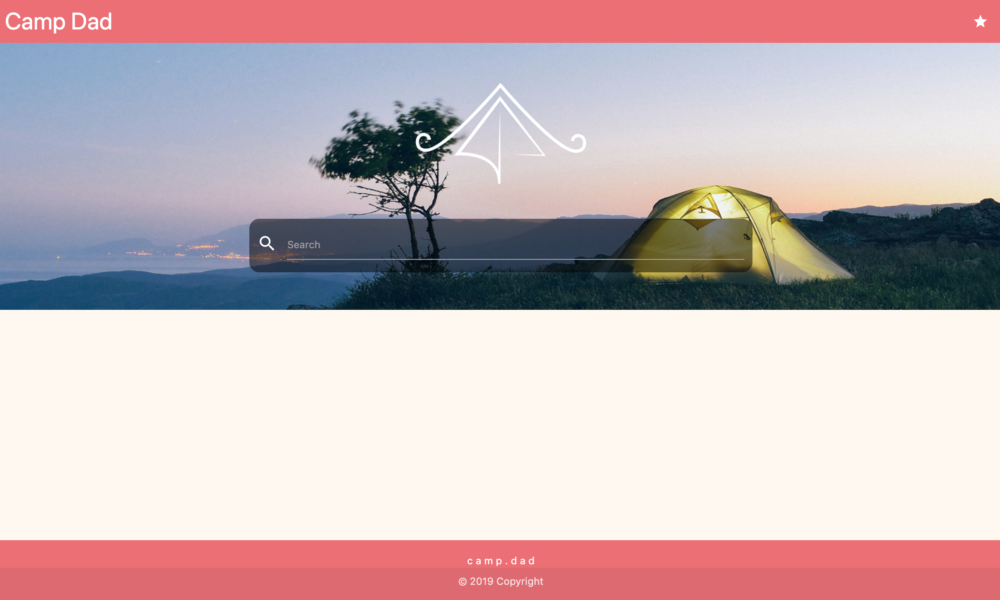
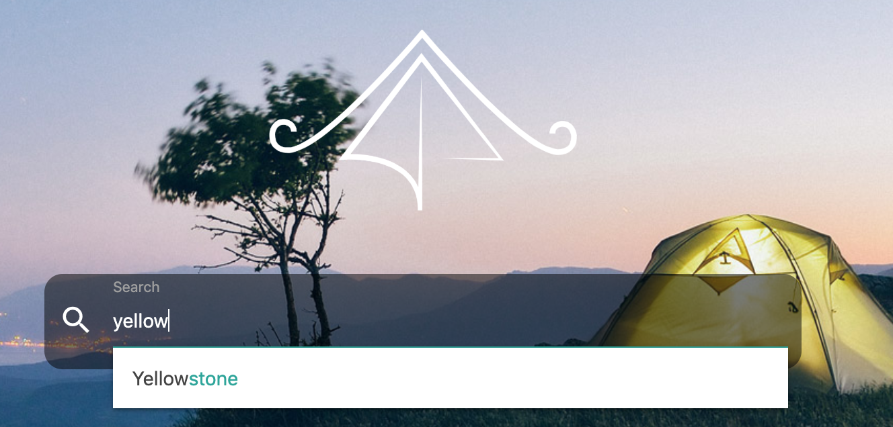
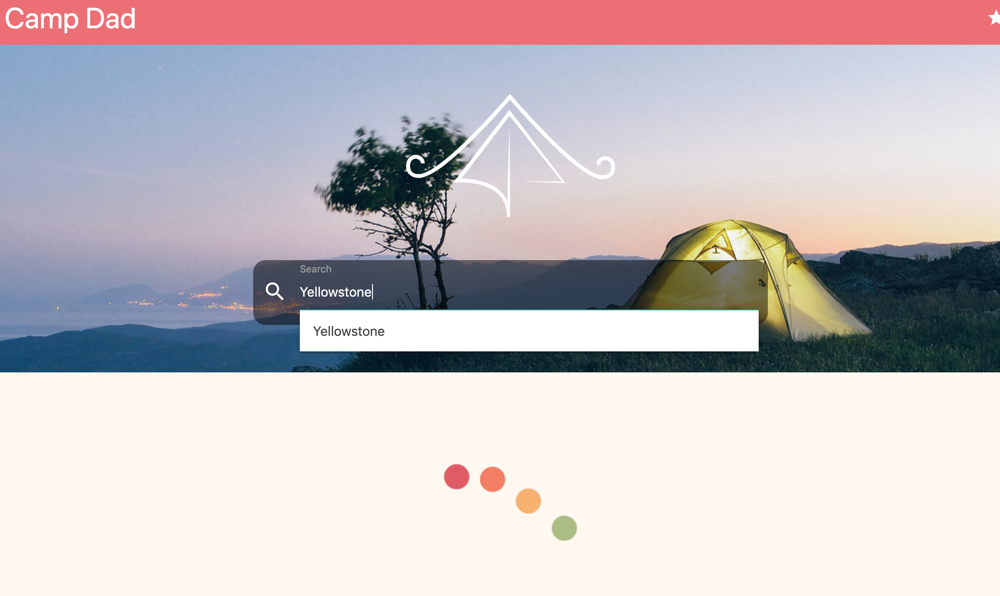
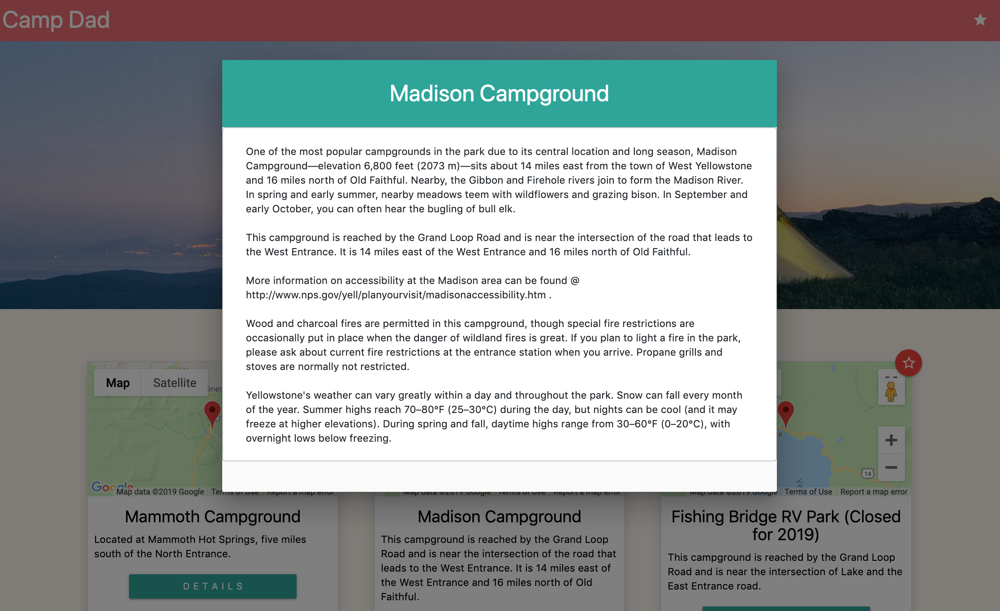

# Project 1

## CampDad
This web application is a campsite search app that provides details regarding particular campsites in an intuitive and user friend UI.

## Technologies Used

<strong>User Interface</strong>

* [HTML](https://developer.mozilla.org/en-US/docs/Web/HTML)
* [CSS](https://developer.mozilla.org/en-US/docs/Web/CSS)
* [Bootstrap](https://getbootstrap.com/)
* [materialize](https://materializecss.com/)

<strong>Programming language and library</strong>
* [JavaScript](https://developer.mozilla.org/en-US/docs/Web/JavaScript)
* [jQuery](https://jquery.com/)

<strong>Client-side Javascript</strong>

* [Ajax](https://developer.mozilla.org/en-US/docs/Web/Guide/AJAX)
* [Firebase](https://firebase.google.com/)

<strong>APIs</strong>

* [National Parks Service API](https://www.nps.gov/subjects/developer/api-documentation.htm)
* [Google Maps API](https://developers.google.com/maps/documentation/javascript/examples/place-search)

## Author

gljacobs, Victoire44, matthewryanhagarty, shualton

